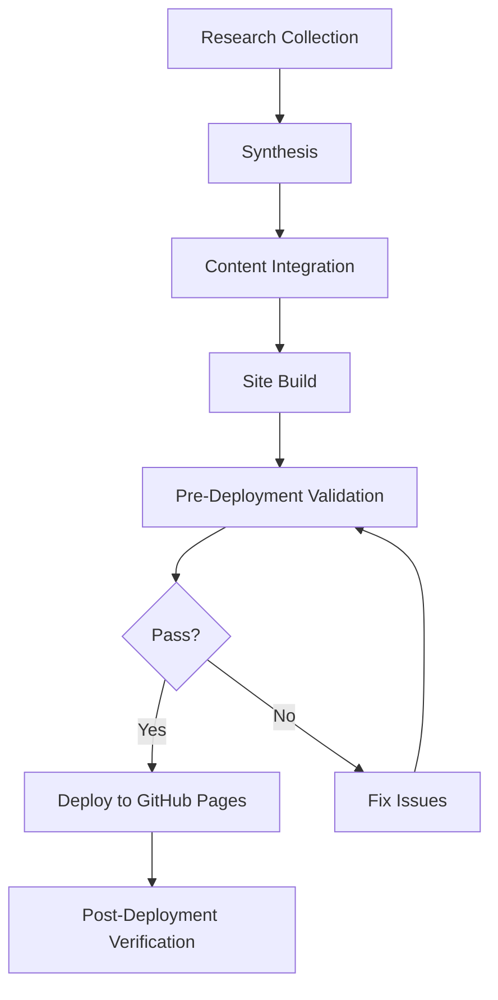

# Integration Guidelines for Phase 2 Implementation

## Document Purpose

This document provides practical integration guidelines for Phase 2 teams implementing the Orchestrator Agent system architecture. It serves as a bridge between the architecture documentation ([`SYSTEM_ARCHITECTURE.md`](SYSTEM_ARCHITECTURE.md)) and actual implementation.

---

## 1. Phase 2 Overview

### 1.1 Phase 2 Objectives

**Phase 2: Strategy and Design** encompasses three critical tasks:

1. **Task 2.1**: Content Synthesis Plan
   - **Owner**: Content Strategist Mode
   - **Dependencies**: Tasks 1.1 and 1.2 (Discovery reports)
   - **Deliverables**: Content strategy framework, priority matrix

2. **Task 2.2**: Orchestrator Prompt Design  
   - **Owner**: Prompt Engineering Specialist Mode
   - **Dependencies**: Tasks 1.1, 1.2, and 2.1
   - **Deliverables**: Orchestrator agent prompt, templates, integration guidelines

3. **Task 2.3**: Technical Architecture Plan
   - **Owner**: Technical Architect Mode  
   - **Dependencies**: Tasks 1.2 and 2.1
   - **Deliverables**: Architecture diagram, deployment pipeline, automation workflow

### 1.2 Success Criteria

Phase 2 is complete when:
- [ ] Content synthesis framework defines clear integration path
- [ ] Orchestrator prompt is testable and functional
- [ ] Technical architecture supports all planned features
- [ ] All deliverables validated through human checkpoint
- [ ] Phase 3 implementation team has clear guidance

---

## 2. Working with Existing Architecture

### 2.1 Key Architecture Documents

| Document | Purpose | Priority | Location |
|----------|---------|----------|----------|
| **SYSTEM_ARCHITECTURE.md** | Complete system design | HIGH | `design/` |
| **ORCHESTRATOR_AGENT_PROMPT_SPEC.md** | Orchestrator prompt specification | HIGH | `design/` |
| **data_inventory_report.md** | Research data assessment | HIGH | root |
| **site_audit_report.md** | Current site analysis | HIGH | root |

**Reading Order for Phase 2 Teams**:
1. Start with this document (INTEGRATION_GUIDELINES.md)
2. Review relevant sections of SYSTEM_ARCHITECTURE.md
3. Study ORCHESTRATOR_AGENT_PROMPT_SPEC.md for prompt design
4. Reference discovery reports as needed

### 2.2 Architecture Constraints

**MUST Follow**:
- Boomerang Coordination Pattern for all task returns
- JSON format for task maps and state management
- File restrictions per mode (architect = `.md` files only)
- Human checkpoint gates at phase boundaries
- Hierarchical task planning (Strategic → Tactical → Operational)

**SHOULD Follow**:
- C4 model for architecture diagrams
- ADR format for technical decisions
- Consistent file naming conventions
- Standardized logging format

**MAY Customize**:
- Specific task decomposition approaches
- Specialist mode selection (within capability matrix)
- Implementation technologies (within constraints)
- Validation testing approaches

---

## 3. Content Synthesis Plan (Task 2.1)

### 3.1 Integration Points

**Input Sources**:
```
research/jun-nov-2025/synthesis/
├── workflow_engineering_patterns.md    → PRIMARY source for patterns
├── monthly_summary_11_2025.md          → Latest research findings
└── [other monthly summaries]           → Historical context

data/processed/
├── techniques.json                     → Existing technique database
└── technique_categories.json           → Current categorization
```

**Expected Outputs**:
```
design/
├── content_synthesis_framework.md      → Strategy document
└── content_prioritization_matrix.json  → Priority rankings
```

### 3.2 Content Mapping Strategy

#### Step 1: Gap Analysis
Compare research findings with existing site content:

```yaml
analysis_dimensions:
  - technique_coverage: "Which new techniques to add?"
  - pattern_integration: "Where do workflow patterns fit?"
  - category_expansion: "New categories needed?"
  - relationship_mapping: "How do new items relate to existing?"
```

#### Step 2: Priority Assignment
Use this matrix for prioritization:

| Priority | Criteria | Integration Timeline |
|----------|----------|---------------------|
| **P0 - Critical** | Core workflow patterns, Nov 2025 findings | Phase 3 Sprint 1 |
| **P1 - High** | New techniques with examples, tool updates | Phase 3 Sprint 2 |
| **P2 - Medium** | Historical summaries, relationship enhancements | Phase 3 Sprint 3 |
| **P3 - Low** | Nice-to-have additions, experimental features | Post-Phase 4 |

#### Step 3: Integration Pathways

**Pathway A: Direct Addition**
- Content fits existing structure
- No conflicts with current content
- Example: Adding new technique to existing category

**Pathway B: Enhanced Merge**
- Content enhances existing items
- Requires relationship updates
- Example: Adding implementation details to existing pattern

**Pathway C: New Structure**
- Content requires new categories/sections
- Architectural impact on site
- Example: Adding "Workflow Patterns" section

### 3.3 Content Schema Alignment

Ensure all new content follows existing schemas:

**Technique Schema** (`data/processed/techniques.json`):
```json
{
  "id": "tech_XXX",
  "name": "Technique Name",
  "category": "Category Name",
  "description": "Detailed description",
  "implementation": {
    "steps": ["Step 1", "Step 2"],
    "example": "Code or text example",
    "best_practices": ["Practice 1", "Practice 2"]
  },
  "related_techniques": ["tech_YYY", "tech_ZZZ"],
  "metadata": {
    "added_date": "2025-11-04",
    "source": "Research paper or repo",
    "complexity": "basic|intermediate|advanced",
    "use_cases": ["Use case 1", "Use case 2"]
  }
}
```

**Pattern Schema** (NEW - to be defined in 2.1):
```json
{
  "id": "pattern_XXX",
  "name": "Pattern Name",
  "type": "workflow|coordination|optimization",
  "intent": "What problem does this solve?",
  "motivation": "Why use this pattern?",
  "structure": {
    "participants": ["Component A", "Component B"],
    "collaborations": "How participants interact"
  },
  "implementation": {
    "guidelines": ["Guideline 1", "Guideline 2"],
    "code_example": "Implementation code",
    "known_uses": ["Use case 1", "Use case 2"]
  },
  "consequences": {
    "benefits": ["Benefit 1", "Benefit 2"],
    "tradeoffs": ["Tradeoff 1", "Tradeoff 2"]
  },
  "related_patterns": ["pattern_YYY"],
  "techniques_used": ["tech_AAA", "tech_BBB"]
}
```

### 3.4 Quality Assurance Checklist

Before completing Task 2.1:
- [ ] All content items mapped to integration pathways
- [ ] Priorities assigned with clear rationale
- [ ] Schema compatibility verified
- [ ] Relationship mappings complete
- [ ] Human checkpoint presentation prepared

---

## 4. Orchestrator Prompt Design (Task 2.2)

### 4.1 Using the Prompt Specification

The [`ORCHESTRATOR_AGENT_PROMPT_SPEC.md`](ORCHESTRATOR_AGENT_PROMPT_SPEC.md) document provides:
- Complete prompt template (Section 2.1)
- Mode selection matrix (Section 3)
- Task decomposition methodology (Section 4)
- Validation and quality criteria (Section 5)

**Your Task**: Adapt this specification into:
1. **Initialization prompt**: What orchestrator receives at project start
2. **Task templates**: Reusable patterns for common task types
3. **Integration guidelines**: How to connect orchestrator to site updates

### 4.2 Prompt Components to Customize

#### Component 1: Project Context
Add specific context about this project:

```markdown
## Project-Specific Context

**Project Name**: Orchestrator Agent Prompt Design and Site Update
**Project Goal**: Integrate 6 months of AI research into prompt engineering site
**Key Assets**:
- Research repository: C:\Users\mnehm\Documents\GitHub\vario-ai\projects\research
- Site repository: https://github.com/Mnehmos/Prompt-Engineering
- Live site: https://mnehmos.github.io/Prompt-Engineering/

**Key Constraints**:
- Must maintain existing site functionality
- GitHub Pages static hosting only
- File-based data storage (JSON)
- Human approval required at phase gates
```

#### Component 2: Research Integration Templates
Create templates for research-specific tasks:

```markdown
## Research Data Integration Task Template

**Task Type**: Research Integration
**Standard Fields**:
- research_period: "Month/Year of research data"
- data_location: "Path to research files"
- synthesis_output: "Expected synthesis document"
- integration_target: "Site section to update"
- validation_criteria: "How to verify integration success"

**Example**:
```json
{
  "task_id": "integrate_nov_2025_research",
  "research_period": "November 2025",
  "data_location": "research/jun-nov-2025/synthesis/monthly_summary_11_2025.md",
  "synthesis_output": "data/processed/techniques_nov_2025.json",
  "integration_target": "docs/latest-research.html",
  "validation_criteria": [
    "All 7 new techniques added to database",
    "Relationships mapped correctly",
    "Site builds without errors"
  ]
}
```
```

#### Component 3: Site Update Workflow
Define standard workflow for site updates:



### 4.3 Integration with MCP Servers

Document how orchestrator should delegate MCP operations:

```yaml
mcp_integration_pattern:
  orchestrator_role: "Delegates research tasks, does NOT call MCP directly"
  
  delegation_example:
    task_id: "research_latest_context_engineering"
    delegate_to: "Research Specialist Mode"
    instructions:
      - "Use arXiv MCP to search for 'context engineering' papers from 2025"
      - "Use Brave Search MCP for community discussions"
      - "Synthesize findings into structured report"
      - "Return via boomerang with artifacts"
    
  orchestrator_validation:
    - "Verify research report contains structured findings"
    - "Check for proper citations and sources"
    - "Ensure synthesis is actionable for site integration"
```

### 4.4 Testing Scenarios

Define test cases for prompt validation:

**Test Case 1: Simple Task Delegation**
```yaml
input: "Audit the research data directory"
expected_output:
  - task_map: "Single task with clear scope"
  - mode_selection: "Data Analyst Specialist"
  - validation_criteria: "Comprehensive inventory report"
```

**Test Case 2: Multi-Phase Project**
```yaml
input: "Update site with November 2025 research"
expected_output:
  - task_map: "Multi-phase with dependencies"
  - phases: [Discovery, Synthesis, Integration, Deployment]
  - human_checkpoints: "At each phase boundary"
```

**Test Case 3: Error Recovery**
```yaml
input: "Specialist mode fails task validation"
expected_output:
  - error_detection: "Orchestrator identifies validation failure"
  - retry_logic: "Provides specific feedback and retries"
  - escalation: "Alerts user if max retries exceeded"
```

---

## 5. Technical Architecture Plan (Task 2.3)

### 5.1 Architecture Extension Points

The system architecture defines these extension points:

**Container Level Extensions**:
- Research Container: Add new MCP servers as available
- Synthesis Container: Add new analysis algorithms
- Deployment Container: Add CI/CD enhancements

**Component Level Extensions**:
- Task Decomposition Engine: Add new decomposition patterns
- Mode Delegation Manager: Add new specialist modes
- Validation Engine: Add new quality checks

### 5.2 Deployment Pipeline Design

Build upon the architecture's deployment pipeline (Section 6.1):

**Required Components**:

1. **Content Validator**
   ```javascript
   // scripts/validate-content.js
   function validateTechniques(techniquesJson) {
     // Validate schema
     // Check required fields
     // Verify relationships
     // Return pass/fail with details
   }
   ```

2. **Site Builder**
   ```bash
   # scripts/build-site.sh
   #!/bin/bash
   # Merge research data with existing content
   # Generate HTML from templates
   # Optimize assets
   # Run validations
   ```

3. **Deployment Script**
   ```bash
   # scripts/deploy.sh
   #!/bin/bash
   # Pre-flight checks
   # Git operations
   # Post-deployment verification
   # Rollback on failure
   ```

4. **Monitoring Setup**
   ```yaml
   # .github/workflows/monitor.yml
   # Check site availability
   # Validate interactive features
   # Report metrics
   ```

### 5.3 Automation Workflow Design

Define GitHub Actions workflows:

**Workflow 1: Content Integration** (`.github/workflows/integrate-content.yml`)
```yaml
name: Integrate Research Content
on:
  workflow_dispatch:
    inputs:
      research_period:
        description: 'Research period (e.g., 2025-11)'
        required: true
      
jobs:
  integrate:
    runs-on: ubuntu-latest
    steps:
      - uses: actions/checkout@v3
      - name: Validate Research Data
        run: npm run validate:research
      - name: Merge Content
        run: npm run merge:content
      - name: Build Site
        run: npm run build
      - name: Run Tests
        run: npm test
      - name: Deploy Preview
        run: npm run deploy:preview
```

**Workflow 2: Automated Monthly Update** (`.github/workflows/monthly-update.yml`)
```yaml
name: Monthly Research Update
on:
  schedule:
    - cron: '0 0 1 * *'  # First day of each month

jobs:
  research-update:
    runs-on: ubuntu-latest
    steps:
      - name: Trigger Orchestrator
        run: |
          # Call orchestrator with monthly update task
          # Orchestrator delegates to Research Specialist
          # Research Specialist uses MCP servers
          # Synthesis and integration follow
```

### 5.4 Technical Stack Recommendations

Based on architecture constraints and requirements:

**Frontend**:
- HTML5 + CSS3 (existing)
- JavaScript ES6+ (existing)
- D3.js for visualizations (from research app)
- No framework required (keep it simple)

**Data Processing**:
- Node.js scripts for JSON manipulation
- JSON Schema for validation
- Static generation (no runtime processing)

**Build Tools**:
- npm scripts for task automation
- GitHub Actions for CI/CD
- Shell scripts for deployment

**Version Control**:
- Git with semantic commits
- Branch strategy: main (production) + development branches
- Tag releases for rollback capability

---

## 6. Cross-Task Integration

### 6.1 Task Dependencies

```
Task 2.1 (Content Strategy)
    │
    ├─> Informs Task 2.2 (What content to integrate)
    └─> Informs Task 2.3 (Technical requirements)

Task 2.2 (Orchestrator Prompt)
    │
    └─> Uses Task 2.1 outputs for task templates

Task 2.3 (Technical Architecture)
    │
    ├─> Uses Task 2.1 priorities for pipeline design
    └─> Implements Task 2.2 orchestrator capabilities
```

### 6.2 Shared Data Structures

All Phase 2 tasks should use consistent data structures:

**Priority Structure**:
```json
{
  "priority_level": "P0|P1|P2|P3",
  "rationale": "Why this priority?",
  "dependencies": ["What must happen first?"],
  "estimated_effort": "Hours or days",
  "risk_level": "low|medium|high"
}
```

**Integration Item Structure**:
```json
{
  "source": "Path to research artifact",
  "target": "Path to site location",
  "type": "addition|enhancement|replacement",
  "priority": "P0|P1|P2|P3",
  "validation": "How to verify success"
}
```

### 6.3 Handoff to Phase 3

Phase 2 deliverables enable Phase 3 to:

**From Task 2.1**:
- Know exactly what content to integrate
- Understand priority order for implementation
- Have clear acceptance criteria

**From Task 2.2**:
- Initialize orchestrator for Phase 3 coordination
- Use task templates for common operations
- Follow validated delegation patterns

**From Task 2.3**:
- Implement automated pipelines
- Deploy with confidence
- Monitor effectively

---

## 7. Quality Assurance

### 7.1 Phase 2 Validation Checklist

Before requesting Phase 2 approval:

**Task 2.1 Complete**:
- [ ] Content strategy document comprehensive
- [ ] All research items mapped to integration pathways
- [ ] Priorities clearly justified
- [ ] Schema definitions complete
- [ ] Phase 3 team can proceed with clarity

**Task 2.2 Complete**:
- [ ] Orchestrator prompt is testable
- [ ] Task templates cover common scenarios
- [ ] Integration guidelines are actionable
- [ ] Error handling is robust
- [ ] Test cases validate functionality

**Task 2.3 Complete**:
- [ ] Architecture diagrams are clear
- [ ] Deployment pipeline is defined
- [ ] Automation workflows are specified
- [ ] Technical stack decisions are documented
- [ ] Rollback procedures are defined

**Overall Phase 2**:
- [ ] All three tasks complete and validated
- [ ] No blocking issues identified
- [ ] Human checkpoint presentation ready
- [ ] Documentation complete and accessible
- [ ] Phase 3 can start immediately after approval

### 7.2 Human Checkpoint Preparation

Prepare these materials for Phase 2 checkpoint:

1. **Executive Summary** (1 page)
   - Key decisions made
   - Artifacts produced
   - Next phase readiness

2. **Artifact Inventory**
   - List all deliverables
   - Location and purpose
   - Validation status

3. **Risk Assessment**
   - Identified risks
   - Mitigation strategies
   - Contingency plans

4. **Next Phase Preview**
   - Phase 3 objectives
   - Timeline estimate
   - Resource requirements

---

## 8. Common Pitfalls to Avoid

### 8.1 Architecture Violations

**❌ DON'T**:
- Skip boomerang returns (all tasks must return to orchestrator)
- Modify architecture constraints without approval
- Ignore file restrictions per mode
- Skip human checkpoints
- Work outside defined task scope

**✅ DO**:
- Follow boomerang pattern religiously
- Respect mode capabilities and constraints
- Request checkpoints at phase boundaries
- Stay within task scope or request scope expansion
- Document all architectural decisions (ADRs)

### 8.2 Integration Mistakes

**❌ DON'T**:
- Assume content format compatibility
- Skip schema validation
- Ignore relationship mappings
- Deploy without validation
- Merge conflicting content silently

**✅ DO**:
- Validate all schema compatibility
- Run comprehensive pre-deployment tests
- Document conflict resolution decisions
- Use automated validation tools
- Maintain content traceability

### 8.3 Prompt Design Errors

**❌ DON'T**:
- Make prompt too generic or too specific
- Skip error handling scenarios
- Assume perfect specialist outputs
- Ignore token limit constraints
- Forget human-in-the-loop patterns

**✅ DO**:
- Balance specificity with flexibility
- Design robust error recovery
- Validate all specialist returns
- Manage context efficiently
- Enable human oversight at key points

---

## 9. Reference Materials

### 9.1 Key Architecture Sections

For quick reference, these architecture sections are most relevant to Phase 2:

| Section | Document | Relevance |
|---------|----------|-----------|
| **Task Decomposition** | ORCHESTRATOR_AGENT_PROMPT_SPEC.md §4 | Critical for 2.2 |
| **Data Flow** | SYSTEM_ARCHITECTURE.md §4 | Critical for 2.1 |
| **Deployment Pipeline** | SYSTEM_ARCHITECTURE.md §6 | Critical for 2.3 |
| **Mode Selection Matrix** | ORCHESTRATOR_AGENT_PROMPT_SPEC.md §3 | Important for 2.2 |
| **ADR Examples** | SYSTEM_ARCHITECTURE.md §7 | Important for 2.3 |

### 9.2 External References

- **C4 Model**: https://c4model.com/ (for architecture diagrams)
- **ADR Template**: https://github.com/joelparkerhenderson/architecture-decision-record
- **JSON Schema**: https://json-schema.org/ (for content validation)
- **GitHub Actions**: https://docs.github.com/actions (for automation)
- **SPARC Framework**: (from research data, workflow patterns)

### 9.3 Support Contacts

**Questions About**:
- **Architecture decisions**: Architect Mode (this document author)
- **Discovery findings**: Data Analyst Specialist, Web Content Specialist  
- **Research integration**: Content Strategist (Task 2.1 owner)
- **Technical implementation**: Technical Architect (Task 2.3 owner)

---

## 10. Next Steps

### 10.1 Immediate Actions

1. **Review Architecture Documents**
   - Read SYSTEM_ARCHITECTURE.md (focus on relevant sections)
   - Study ORCHESTRATOR_AGENT_PROMPT_SPEC.md (complete)
   - Reference discovery reports as needed

2. **Set Up Work Environment**
   - Clone/access research repository
   - Verify file structure matches architecture
   - Test access to necessary MCP servers

3. **Begin Task 2.1**
   - Content Strategist analyzes research data
   - Maps content to integration pathways
   - Defines priority matrix
   - Creates synthesis framework

### 10.2 Success Checkpoints

**Week 1**:
- [ ] Task 2.1 in progress
- [ ] Initial content mapping complete
- [ ] Priority matrix drafted

**Week 2**:
- [ ] Task 2.1 complete, human checkpoint passed
- [ ] Task 2.2 started
- [ ] Task 2.3 started

**Week 3**:
- [ ] Tasks 2.2 and 2.3 complete
- [ ] Phase 2 validation passed
- [ ] Human checkpoint presentation ready

**Week 4**:
- [ ] Phase 2 approved
- [ ] Phase 3 team briefed
- [ ] Implementation begins

---

## Appendix: Quick Start Checklist

**For Content Strategist (Task 2.1)**:
- [ ] Read §3 of this document
- [ ] Review data_inventory_report.md
- [ ] Access research/jun-nov-2025/synthesis/
- [ ] Define content schema extensions
- [ ] Create priority matrix

**For Prompt Engineering Specialist (Task 2.2)**:
- [ ] Read §4 of this document
- [ ] Study ORCHESTRATOR_AGENT_PROMPT_SPEC.md completely  
- [ ] Review existing task map example
- [ ] Create initialization prompt
- [ ] Define task templates
- [ ] Write integration guidelines

**For Technical Architect (Task 2.3)**:
- [ ] Read §5 of this document
- [ ] Review SYSTEM_ARCHITECTURE.md §6 (Deployment)
- [ ] Study site_audit_report.md
- [ ] Design deployment pipeline
- [ ] Create automation workflows
- [ ] Document technical decisions (ADRs)

---

**Document Status**: FINAL - Ready for Phase 2 Handoff  
**Last Updated**: 2025-11-04  
**Owner**: Architect Mode  
**Version**: 1.0  
**Next Review**: After Phase 2 completion