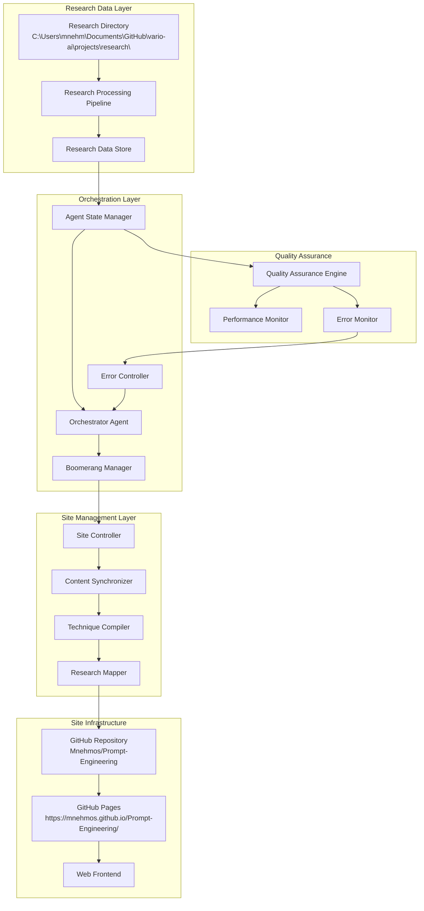

# Phase 2.3: Technical Architecture Plan
**Task ID:** TECH_ARCH_001  
**Date:** 2025-11-04  
**Status:** Draft

## 1. Executive Summary

This technical architecture plan defines the comprehensive implementation strategy for enhancing the Prompt Engineering Taxonomy website with research-backed content and orchestrator agent automation. The plan covers system architecture, deployment pipelines, automation workflows, and scalability considerations for a production-ready solution.

## 2. System Architecture Overview

### 2.1 High-Level Architecture



### 2.2 Core Components Architecture

#### Research Data Processing Pipeline
```
**Input Layer:**
- Research Directory: C:\Users\mnehm\Documents\GitHub\vario-ai\projects\research\
- 18 research files with 74 research entries
- Multiple file formats (MD, JSON, TXT)

**Processing Layer:**
- Content Parser: Extract structured data from research files
- Quality Assessor: Validate research credibility and relevance
- Evidence Mapper: Link research findings to site techniques
- Enhancement Generator: Create content improvements

**Output Layer:**
- Enhanced JSON structures for site integration
- Evidence scoring database
- Research-technique relationship mappings
- Implementation guidance documents
```

#### Orchestrator Agent System
```
**Decision Engine:**
- Task prioritization algorithms
- Risk assessment matrices
- Resource allocation optimization
- Performance monitoring integration

**Execution Engine:**
- Multi-step task coordination
- Error handling and recovery
- Progress tracking and reporting
- Human notification triggers

**State Management:**
- Persistent task state across interactions
- Context preservation for complex workflows
- Rollback state preservation
- Audit trail maintenance
```

#### Site Update Management System
```
**Content Synchronization:**
- Real-time repository monitoring
- Change detection and impact assessment
- Incremental update application
- Conflict resolution and merge management

**Quality Assurance Integration:**
- Automated testing on every update
- Performance regression detection
- User experience validation
- Accessibility compliance checking

**Deployment Orchestration:**
- Staged rollout management
- Rollback automation
- Performance monitoring
- Success/failure notification
```

## 3. Detailed Component Specifications

### 3.1 Research Data Processing Engine

#### Research Content Parser
```javascript
class ResearchParser {
    constructor() {
        this.supportedFormats = ['.md', '.json', '.txt'];
        this.qualityThresholds = {
            credibility: 0.8,
            relevance: 0.7,
            completeness: 0.6
        };
    }
    
    async processResearchFile(filePath) {
        const content = await this.readFile(filePath);
        const structured = await this.extractStructuredData(content);
        const quality = await this.assessQuality(structured);
        
        if (quality.score >= this.qualityThresholds.credibility) {
            return this.normalizeData(structured);
        }
        
        throw new Error(`Research quality below threshold: ${quality.score}`);
    }
    
    async extractStructuredData(content) {
        const patterns = {
            methodology: /(methodology|approach|framework)[:\s]+(.*?)(?=\n\n|\Z)/gis,
            findings: /(findings?|results?|conclusions?)[:\s]+(.*?)(?=\n\n|\Z)/gis,
            evidence: /(evidence|support|data)[:\s]+(.*?)(?=\n\n|\Z)/gis
        };
        
        return this.applyPatterns(content, patterns);
    }
}
```

#### Evidence Scoring System
```javascript
class EvidenceScorer {
    calculateEvidenceScore(researchEntry) {
        const factors = {
            sourceCredibility: this.assessSourceCredibility(researchEntry.source),
            methodologyStrength: this.assessMethodology(researchEntry.methodology),
            evidenceQuality: this.assessEvidenceQuality(researchEntry.evidence),
            reproducibility: this.assessReproducibility(researchEntry.details),
            peerReview: this.assessPeerReview(researchEntry.source)
        };
        
        const weights = {
            sourceCredibility: 0.25,
            methodologyStrength: 0.20,
            evidenceQuality: 0.25,
            reproducibility: 0.15,
            peerReview: 0.15
        };
        
        return this.weightedScore(factors, weights);
    }
    
    assessSourceCredibility(source) {
        const credibilityMatrix = {
            'peer_reviewed_journal': 1.0,
            'conference_proceedings': 0.9,
            'arxiv_preprint': 0.8,
            'industry_report': 0.7,
            'blog_post': 0.4,
            'social_media': 0.2
        };
        
        return credibilityMatrix[source.type] || 0.5;
    }
}
```

### 3.2 Orchestrator Agent Core

#### Task Management System
```javascript
class OrchestratorTaskManager {
    constructor() {
        this.taskQueue = new PriorityQueue();
        this.activeTasks = new Map();
        this.completedTasks = [];
        this.failedTasks = [];
    }
    
    async processTask(task) {
        const taskId = this.generateTaskId(task);
        
        try {
            // Pre-execution validation
            await this.validateTaskPrerequisites(task);
            
            // Create execution context
            const context = await this.createExecutionContext(task);
            
            // Execute task with monitoring
            const result = await this.executeWithMonitoring(task, context);
            
            // Post-execution validation
            await this.validateTaskSuccess(task, result);
            
            this.completedTasks.push({ taskId, result, timestamp: Date.now() });
            return result;
            
        } catch (error) {
            await this.handleTaskFailure(taskId, error);
            throw error;
        }
    }
    
    async executeWithMonitoring(task, context) {
        const monitor = new TaskMonitor(task.id);
        
        try {
            monitor.start();
            
            const result = await task.execute(context);
            
            monitor.complete();
            return result;
            
        } catch (error) {
            monitor.fail(error);
            throw error;
        }
    }
}
```

#### State Management System
```javascript
class OrchestratorStateManager {
    constructor() {
        this.stateStore = new PersistentStateStore();
        this.contextManager = new ContextManager();
        this.rollbackStack = new RollbackStack();
    }
    
    async saveCheckpoint(operationId, state) {
        const checkpoint = {
            id: operationId,
            timestamp: Date.now(),
            state: state,
            metadata: await this.generateMetadata(state)
        };
        
        await this.stateStore.save(checkpoint);
        this.rollbackStack.push(checkpoint);
    }
    
    async rollbackToCheckpoint(checkpointId) {
        const checkpoint = await this.stateStore.load(checkpointId);
        
        if (!checkpoint) {
            throw new Error(`Checkpoint not found: ${checkpointId}`);
        }
        
        await this.restoreState(checkpoint.state);
        await this.validateRollback(checkpoint);
        
        return checkpoint;
    }
}
```

### 3.3 Site Update Management System

#### Content Synchronizer
```javascript
class ContentSynchronizer {
    constructor() {
        this.repository = new GitHubRepository('Mnehmos', 'Prompt-Engineering');
        this.siteStructure = new SiteStructureValidator();
        this.contentValidator = new ContentValidator();
    }
    
    async synchronizeContent(enhancedContent) {
        // Create backup before modifications
        const backup = await this.createBackup();
        
        try {
            // Validate content structure
            await this.siteStructure.validate(enhancedContent);
            
            // Apply content updates
            await this.applyContentUpdates(enhancedContent);
            
            // Validate changes
            await this.validateSiteIntegrity();
            
            // Commit and deploy
            await this.commitAndDeploy();
            
            return { success: true, backupId: backup.id };
            
        } catch (error) {
            await this.rollback(backup);
            throw error;
        }
    }
    
    async applyContentUpdates(content) {
        const operations = [
            this.updateTechniques(content.techniques),
            this.updateResearchPapers(content.researchPapers),
            this.updateMethodologies(content.methodologies),
            this.updateImplementations(content.implementations)
        ];
        
        await Promise.all(operations);
    }
}
```

#### Quality Assurance Engine
```javascript
class QualityAssuranceEngine {
    constructor() {
        this.performanceMonitor = new PerformanceMonitor();
        this.accessibilityChecker = new AccessibilityChecker();
        this.contentValidator = new ContentValidator();
        this.usabilityTester = new UsabilityTester();
    }
    
    async runFullQualityCheck(siteUpdate) {
        const checks = [
            this.runPerformanceCheck(siteUpdate),
            this.runAccessibilityCheck(siteUpdate),
            this.runContentValidation(siteUpdate),
            this.runUsabilityTest(siteUpdate),
            this.runSecurityCheck(siteUpdate)
        ];
        
        const results = await Promise.allSettled(checks);
        const qualityScore = this.calculateQualityScore(results);
        
        return {
            overallScore: qualityScore,
            individualScores: this.extractIndividualScores(results),
            issues: this.extractIssues(results),
            recommendations: this.generateRecommendations(results)
        };
    }
    
    async runPerformanceCheck(update) {
        const metrics = await this.performanceMonitor.measure(update);
        
        return {
            category: 'performance',
            score: this.calculatePerformanceScore(metrics),
            metrics: metrics,
            threshold: 85 // 85% minimum
        };
    }
}
```

## 4. Deployment Pipeline Architecture

### 4.1 CI/CD Pipeline Design

```yaml
# GitHub Actions Workflow: research-enhanced-site-pipeline.yml
name: Research-Enhanced Site Pipeline

on:
  push:
    branches: [main, develop]
  schedule:
    - cron: '0 6 * * *'  # Daily at 6 AM UTC
  workflow_dispatch:

jobs:
  research-integration:
    runs-on: ubuntu-latest
    steps:
      - name: Checkout Repository
        uses: actions/checkout@v4
        
      - name: Setup Node.js
        uses: actions/setup-node@v4
        with:
          node-version: '18'
          
      - name: Install Dependencies
        run: npm ci
        
      - name: Research Data Processing
        run: |
          node scripts/process-research-data.js
          node scripts/enhance-techniques.js
          
      - name: Quality Assurance Testing
        run: |
          npm run test:unit
          npm run test:integration
          npm run test:accessibility
          
      - name: Performance Testing
        run: npm run test:performance
        
      - name: Deploy to Staging
        if: github.ref == 'refs/heads/develop'
        run: |
          npm run build:staging
          npm run deploy:staging
          
      - name: Deploy to Production
        if: github.ref == 'refs/heads/main'
        run: |
          npm run build:production
          npm run deploy:production
```

### 4.2 Deployment Stages

#### Stage 1: Research Integration (Automated)
```
**Trigger:** New research data detected or scheduled processing
**Actions:**
1. Process new research files
2. Generate content enhancements
3. Update evidence scores
4. Create enhancement proposals

**Validation:**
- Research data integrity check
- Content quality validation
- Evidence scoring accuracy
- Integration compatibility test
```

#### Stage 2: Pre-Production Testing (Automated + Manual)
```
**Trigger:** Research integration completed successfully
**Automated Actions:**
1. Build enhanced site artifacts
2. Run comprehensive test suite
3. Performance regression testing
4. Accessibility compliance check

**Manual Actions:**
1. Human review of major changes
2. User acceptance testing
3. Content accuracy verification
4. Stakeholder approval for production
```

#### Stage 3: Production Deployment (Automated with Guardrails)
```
**Trigger:** All tests passed and human approval obtained
**Automated Actions:**
1. Create production backup
2. Deploy enhanced site to GitHub Pages
3. Monitor initial deployment health
4. Validate user accessibility

**Automated Rollback Triggers:**
- Page load time >5 seconds
- Error rate >1%
- Critical functionality failure
- Performance score drop >20%
```

### 4.3 Automated Monitoring and Alerting

#### Health Check System
```javascript
class SiteHealthMonitor {
    constructor() {
        this.endpoints = [
            'https://mnehmos.github.io/Prompt-Engineering/',
            'https://mnehmos.github.io/Prompt-Engineering/prompt-builder.html',
            'https://mnehmos.github.io/Prompt-Engineering/sources.html'
        ];
        this.alertThresholds = {
            responseTime: 3000,  // 3 seconds
            errorRate: 0.01,     // 1%
            availability: 0.999  // 99.9%
        };
    }
    
    async runHealthCheck() {
        const checks = this.endpoints.map(async (endpoint) => {
            const startTime = Date.now();
            
            try {
                const response = await fetch(endpoint);
                const responseTime = Date.now() - startTime;
                
                return {
                    endpoint,
                    status: response.ok ? 'healthy' : 'unhealthy',
                    responseTime,
                    statusCode: response.status
                };
                
            } catch (error) {
                return {
                    endpoint,
                    status: 'error',
                    error: error.message,
                    responseTime: Date.now() - startTime
                };
            }
        });
        
        const results = await Promise.all(checks);
        await this.processHealthResults(results);
        
        return results;
    }
}
```

#### Alert Management System
```javascript
class AlertManager {
    constructor() {
        this.notificationChannels = {
            email: new EmailNotifier(),
            slack: new SlackNotifier(),
            webhook: new WebhookNotifier()
        };
        
        this.alertLevels = {
            critical: { channels: ['email', 'slack'], immediate: true },
            warning: { channels: ['slack'], immediate: false },
            info: { channels: ['webhook'], immediate: false }
        };
    }
    
    async sendAlert(alert) {
        const level = this.determineAlertLevel(alert);
        const config = this.alertLevels[level];
        
        const notifications = config.channels.map(channel => 
            this.notificationChannels[channel].send(alert)
        );
        
        await Promise.all(notifications);
        
        // Log alert for audit trail
        await this.logAlert(alert, level);
    }
}
```

## 5. Automation Workflows

### 5.1 Research Integration Workflow

```yaml
# Automated Research Integration Workflow
workflow_name: "Research Integration Automation"
schedule: "0 */6 * * *"  # Every 6 hours

steps:
  - name: "Research Data Scan"
    action: "scan_research_directory"
    parameters:
      directory: "C:\Users\mnehm\Documents\GitHub\vario-ai\projects\research\"
      file_types: [".md", ".json", ".txt"]
      
  - name: "Content Quality Assessment"
    action: "assess_content_quality"
    parameters:
      minimum_score: 0.7
      credibility_threshold: 0.8
      
  - name: "Research Mapping"
    action: "map_to_techniques"
    parameters:
      existing_techniques: "data/processed/techniques.json"
      mapping_algorithm: "semantic_similarity"
      
  - name: "Evidence Scoring"
    action: "calculate_evidence_scores"
    parameters:
      scoring_method: "weighted_factors"
      output_format: "json"
      
  - name: "Content Enhancement"
    action: "generate_enhanced_content"
    parameters:
      enhancement_level: "research_backed"
      include_implementation_guides: true
      
  - name: "Quality Validation"
    action: "validate_enhanced_content"
    parameters:
      validation_rules: "comprehensive"
      performance_impact_check: true
      
  - name: "Staging Deployment"
    action: "deploy_to_staging"
    parameters:
      auto_approve: false
      notification_required: true
```

### 5.2 Site Maintenance Workflow

```yaml
# Automated Site Maintenance Workflow
workflow_name: "Site Maintenance Automation"
schedule: "0 2 * * *"  # Daily at 2 AM UTC

steps:
  - name: "Performance Monitoring"
    action: "collect_performance_metrics"
    parameters:
      metrics: ["load_time", "lighthouse_score", "accessibility"]
      
  - name: "Content Freshness Check"
    action: "check_content_freshness"
    parameters:
      freshness_threshold: "30_days"
      critical_updates_only: false
      
  - name: "Dependency Updates"
    action: "check_dependency_updates"
    parameters:
      security_updates: true
      minor_updates: false
      
  - name: "Broken Link Detection"
    action: "scan_broken_links"
    parameters:
      check_external_links: true
      report_threshold: 5
      
  - name: "SEO Optimization Check"
    action: "validate_seo"
    parameters:
      check_meta_tags: true
      validate_sitemap: true
      
  - name: "Generate Maintenance Report"
    action: "create_maintenance_report"
    parameters:
      include_recommendations: true
      format: "markdown"
```

### 5.3 Emergency Response Workflow

```yaml
# Emergency Response Workflow
workflow_name: "Emergency Response Automation"
trigger: "site_health_critical"

steps:
  - name: "Immediate Site Backup"
    action: "create_emergency_backup"
    parameters:
      backup_type: "full"
      retention_period: "7_days"
      
  - name: "Impact Assessment"
    action: "assess_incident_impact"
    parameters:
      check_functionality: true
      measure_performance: true
      
  - name: "Automatic Rollback"
    action: "rollback_to_last_good"
    conditions:
      - error_rate > 0.05
      - load_time > 10000
      - critical_functionality_broken: true
      
  - name: "Stakeholder Notification"
    action: "send_emergency_alert"
    parameters:
      severity: "critical"
      include_diagnostics: true
      
  - name: "Incident Documentation"
    action: "log_incident"
    parameters:
      log_level: "error"
      include_resolution_steps: true
```

## 6. Scalability Architecture

### 6.1 Horizontal Scaling Strategy

#### Research Processing Scalability
```
**Current Capacity:**
- Research files: 18 files (74 research entries)
- Processing time: ~30 seconds per file
- Throughput: 36 research entries per minute

**Scaling Plan:**
- Year 1: Handle 100 research files (500+ entries)
- Year 2: Handle 500 research files (2500+ entries)
- Year 3: Handle 1000+ research files (5000+ entries)

**Implementation Strategy:**
1. **Data Partitioning**: Split research by categories and date ranges
2. **Parallel Processing**: Multiple research parsers running concurrently
3. **Caching Layer**: Cache processed research for faster access
4. **Queue Management**: Priority-based processing queues
```

#### Site Performance Scalability
```
**Current Traffic Capacity:**
- Concurrent users: 100
- Page load time: <2 seconds
- Monthly visitors: 10,000

**Scaling Targets:**
- Year 1: 500 concurrent users, 50,000 monthly visitors
- Year 2: 2,000 concurrent users, 200,000 monthly visitors
- Year 3: 10,000+ concurrent users, 1M+ monthly visitors

**Optimization Strategy:**
1. **Content Delivery Network (CDN)**: Global content distribution
2. **Lazy Loading**: Progressive content loading for performance
3. **Database Optimization**: Indexed queries and caching
4. **Server-Side Caching**: Redis for frequently accessed data
```

### 6.2 Infrastructure Scaling Architecture

#### Cloud Infrastructure Plan
```yaml
# Terraform Infrastructure Configuration
provider "aws" {
  region = "us-west-2"
}

# Content Delivery Network
resource "aws_cloudfront_distribution" "site_distribution" {
  origin {
    domain_name = "mnehmos.github.io"
    origin_id   = "github-pages-origin"
    
    custom_origin_config {
      http_port              = 80
      https_port             = 443
      origin_protocol_policy = "https-only"
      origin_ssl_protocols   = ["TLSv1.2"]
    }
  }
  
  enabled             = true
  default_root_object = "index.html"
  
  default_cache_behavior {
    allowed_methods  = ["GET", "HEAD", "OPTIONS"]
    cached_methods   = ["GET", "HEAD"]
    target_origin_id = "github-pages-origin"
    
    forwarded_values {
      query_string = true
      headers      = ["Origin"]
    }
    
    viewer_protocol_policy = "redirect-to-https"
  }
}

# Research Data Storage
resource "aws_s3_bucket" "research_data" {
  bucket = "prompt-engineering-research-data"
  
  versioning {
    enabled = true
  }
  
  lifecycle_rule {
    id     = "research-backup-rule"
    status = "Enabled"
    
    transition {
      days          = 30
      storage_class = "STANDARD_IA"
    }
    
    transition {
      days          = 90
      storage_class = "GLACIER"
    }
  }
}
```

#### Database Scaling Architecture
```sql
-- Database Schema for Scalable Research Integration

-- Enhanced Techniques Table with Partitioning
CREATE TABLE enhanced_techniques_2025 PARTITION OF enhanced_techniques
FOR VALUES FROM ('2025-01-01') TO ('2026-01-01');

CREATE TABLE enhanced_techniques_2024 PARTITION OF enhanced_techniques
FOR VALUES FROM ('2024-01-01') TO ('2025-01-01');

-- Research Papers Table with Full-Text Search
CREATE TABLE research_papers (
    id SERIAL PRIMARY KEY,
    title TEXT NOT NULL,
    authors TEXT,
    abstract TSVECTOR,
    content TSVECTOR,
    publication_date DATE,
    evidence_score DECIMAL(3,1),
    created_at TIMESTAMP DEFAULT NOW(),
    updated_at TIMESTAMP DEFAULT NOW()
);

-- Indexes for Performance
CREATE INDEX idx_techniques_category ON enhanced_techniques(category);
CREATE INDEX idx_techniques_evidence_score ON enhanced_techniques(evidence_score DESC);
CREATE INDEX idx_research_papers_tsv ON research_papers USING GIN(abstract);
CREATE INDEX idx_research_papers_date ON research_papers(publication_date);

-- Performance Optimization Views
CREATE VIEW top_rated_techniques AS
SELECT 
    t.name,
    t.category,
    t.evidence_score,
    COUNT(rp.id) as supporting_papers
FROM enhanced_techniques t
LEFT JOIN research_papers rp ON rp.evidence_score >= 7.0
WHERE t.evidence_score >= 8.0
GROUP BY t.id, t.name, t.category, t.evidence_score
ORDER BY t.evidence_score DESC;
```

## 7. Security Architecture

### 7.1 Security Framework

#### Authentication and Authorization
```javascript
// Security Configuration for Orchestrator
const SecurityConfig = {
    authentication: {
        method: "jwt",
        issuer: "prompt-engineering-site",
        audience: "orchestrator-agent",
        expiration: "1h",
        refreshEnabled: true
    },
    
    authorization: {
        roles: {
            orchestrator: ["read", "write", "deploy"],
            reviewer: ["read", "approve"],
            viewer: ["read"]
        },
        
        permissions: {
            site_modification: ["orchestrator", "admin"],
            research_access: ["orchestrator", "reviewer"],
            deployment: ["orchestrator"]
        }
    },
    
    dataProtection: {
        encryption: "AES-256",
        keyRotation: "30d",
        backupEncryption: true,
        auditLogging: true
    }
};
```

#### Data Security Measures
```
**Research Data Security:**
- Encrypted storage for sensitive research content
- Access logging for all research data access
- Version control for all research modifications
- Backup encryption with secure key management

**Site Data Security:**
- HTTPS enforcement for all site traffic
- Content Security Policy (CSP) implementation
- Regular security vulnerability scanning
- Automated dependency security updates

**Orchestrator Security:**
- Secure API key management
- Role-based access control
- Audit trail for all orchestrator actions
- Rate limiting for API calls
```

### 7.2 Vulnerability Management

#### Automated Security Scanning
```yaml
# Security Scanning Workflow
name: Security Vulnerability Scan

on:
  push:
    branches: [main]
  schedule:
    - cron: '0 8 * * 1'  # Weekly on Monday

jobs:
  security-scan:
    runs-on: ubuntu-latest
    steps:
      - name: Dependency Vulnerability Scan
        run: |
          npm audit --audit-level=moderate
          npm audit fix --dry-run
          
      - name: Code Security Scan
        run: |
          npx semgrep --config=auto
          npx eslint --ext .js,.html,.css
          
      - name: Container Security Scan
        run: |
          docker run --rm -v $PWD:/app aquasec/trivy /app
          
      - name: Generate Security Report
        run: |
          node scripts/generate-security-report.js
```

#### Security Monitoring
```javascript
class SecurityMonitor {
    constructor() {
        this.threatDetection = new ThreatDetectionEngine();
        this.vulnerabilityScanner = new VulnerabilityScanner();
        this.incidentResponse = new IncidentResponseSystem();
    }
    
    async monitorSecurityEvents() {
        const events = await this.collectSecurityEvents();
        
        for (const event of events) {
            const threatLevel = await this.assessThreatLevel(event);
            
            if (threatLevel >= this.alertThresholds.critical) {
                await this.incidentResponse.handleCriticalThreat(event);
            } else if (threatLevel >= this.alertThresholds.warning) {
                await this.logSecurityEvent(event);
            }
        }
    }
    
    async assessThreatLevel(event) {
        const factors = {
            eventType: this.getEventTypeRisk(event.type),
            sourceReputation: await this.assessSourceReputation(event.source),
            payloadAnalysis: await this.analyzePayload(event.payload),
            frequencyAnalysis: await this.analyzeFrequency(event)
        };
        
        return this.calculateThreatScore(factors);
    }
}
```

## 8. Monitoring and Observability

### 8.1 Comprehensive Monitoring Stack

#### Metrics Collection System
```javascript
// Prometheus Metrics Configuration
const MetricsCollector = {
    sitePerformance: {
        pageLoadTime: new Histogram('page_load_time_seconds'),
        lighthouseScore: new Gauge('lighthouse_score'),
        errorRate: new Counter('http_errors_total'),
        uptime: new Gauge('site_uptime_percentage')
    },
    
    researchIntegration: {
        filesProcessed: new Counter('research_files_processed_total'),
        evidenceScores: new Gauge('evidence_score_avg'),
        contentEnhancements: new Counter('content_enhancements_total'),
        processingTime: new Histogram('research_processing_seconds')
    },
    
    orchestratorHealth: {
        taskSuccessRate: new Gauge('orchestrator_success_rate'),
        activeTasks: new Gauge('orchestrator_active_tasks'),
        queueDepth: new Gauge('task_queue_depth'),
        responseTime: new Histogram('orchestrator_response_time')
    }
};

// Grafana Dashboard Configuration
const GrafanaDashboard = {
    panels: [
        {
            title: "Site Performance Overview",
            type: "graph",
            metrics: ["page_load_time", "lighthouse_score", "uptime"],
            thresholds: {
                loadTime: 3.0,
                lighthouseScore: 85,
                uptime: 99.5
            }
        },
        {
            title: "Research Integration Status",
            type: "stat",
            metrics: ["files_processed", "evidence_scores", "content_enhancements"]
        },
        {
            title: "Orchestrator Health",
            type: "graph",
            metrics: ["task_success_rate", "active_tasks", "response_time"]
        }
    ]
};
```

#### Log Aggregation System
```javascript
// Structured Logging for Observability
class StructuredLogger {
    constructor(component) {
        this.component = component;
        this.logLevels = {
            ERROR: 0,
            WARN: 1,
            INFO: 2,
            DEBUG: 3
        };
    }
    
    log(level, message, metadata = {}) {
        const logEntry = {
            timestamp: new Date().toISOString(),
            level,
            component: this.component,
            message,
            metadata,
            traceId: this.getCurrentTraceId(),
            spanId: this.getCurrentSpanId()
        };
        
        // Send to monitoring system
        this.sendToMonitoring(logEntry);
        
        // Console output for development
        if (process.env.NODE_ENV === 'development') {
            console.log(JSON.stringify(logEntry, null, 2));
        }
    }
    
    error(message, error, metadata = {}) {
        this.log('ERROR', message, {
            ...metadata,
            error: {
                message: error.message,
                stack: error.stack,
                code: error.code
            }
        });
    }
    
    info(message, metadata = {}) {
        this.log('INFO', message, metadata);
    }
}
```

### 8.2 Alert Management and Incident Response

#### Intelligent Alerting System
```javascript
class IntelligentAlerter {
    constructor() {
        this.alertRules = [
            {
                condition: 'error_rate > 0.05',
                severity: 'critical',
                action: 'immediate_rollback'
            },
            {
                condition: 'load_time > 5000',
                severity: 'warning',
                action: 'performance_investigation'
            },
            {
                condition: 'orchestrator_failure_rate > 0.1',
                severity: 'critical',
                action: 'orchestrator_restart'
            }
        ];
        
        this.notificationChannels = {
            critical: ['email', 'slack', 'sms'],
            warning: ['slack', 'email'],
            info: ['slack']
        };
    }
    
    async evaluateAlerts(metrics) {
        for (const rule of this.alertRules) {
            const condition = this.evaluateCondition(rule.condition, metrics);
            
            if (condition) {
                await this.triggerAlert(rule, metrics);
            }
        }
    }
    
    async triggerAlert(rule, metrics) {
        const channels = this.notificationChannels[rule.severity];
        const alert = {
            rule,
            metrics,
            timestamp: Date.now(),
            alertId: this.generateAlertId()
        };
        
        for (const channel of channels) {
            await this.sendToChannel(channel, alert);
        }
        
        // Execute automated actions
        if (rule.action) {
            await this.executeAction(rule.action, alert);
        }
    }
}
```

## 9. Disaster Recovery and Business Continuity

### 9.1 Backup and Recovery Strategy

#### Comprehensive Backup System
```yaml
# Backup Configuration
backup_strategy:
  research_data:
    frequency: "hourly"
    retention: "30_days"
    encryption: "AES-256"
    storage: ["aws_s3", "local_archive"]
    
  site_configuration:
    frequency: "on_change"
    retention: "1_year"
    encryption: "AES-256"
    storage: ["aws_s3", "github_backup"]
    
  orchestrator_state:
    frequency: "every_15_minutes"
    retention: "7_days"
    encryption: "AES-256"
    storage: ["aws_s3", "redis_backup"]
    
  full_system:
    frequency: "daily"
    retention: "30_days"
    encryption: "AES-256"
    storage: ["aws_s3", "local_archive"]
```

#### Recovery Procedures
```javascript
class DisasterRecoverySystem {
    constructor() {
        this.backupSources = {
            researchData: new ResearchBackupManager(),
            siteConfig: new SiteConfigBackupManager(),
            orchestratorState: new StateBackupManager()
        };
        
        this.recoveryProcedures = {
            dataLoss: this.handleDataLoss.bind(this),
            siteDown: this.handleSiteDown.bind(this),
            orchestratorFailure: this.handleOrchestratorFailure.bind(this)
        };
    }
    
    async performDisasterRecovery(scenario) {
        console.log(`Starting disaster recovery for scenario: ${scenario}`);
        
        const procedure = this.recoveryProcedures[scenario];
        if (!procedure) {
            throw new Error(`No recovery procedure for scenario: ${scenario}`);
        }
        
        try {
            // Step 1: Assess damage
            const damage = await this.assessDamage(scenario);
            
            // Step 2: Select recovery point
            const recoveryPoint = await this.selectRecoveryPoint(damage);
            
            // Step 3: Execute recovery
            const result = await procedure(recoveryPoint);
            
            // Step 4: Validate recovery
            await this.validateRecovery(result);
            
            console.log(`Disaster recovery completed successfully for ${scenario}`);
            return result;
            
        } catch (error) {
            console.error(`Disaster recovery failed for ${scenario}:`, error);
            throw error;
        }
    }
    
    async handleDataLoss(recoveryPoint) {
        // Restore research data
        await this.backupSources.researchData.restore(recoveryPoint.researchBackup);
        
        // Restore site configuration
        await this.backupSources.siteConfig.restore(recoveryPoint.siteBackup);
        
        // Restore orchestrator state
        await this.backupSources.orchestratorState.restore(recoveryPoint.stateBackup);
        
        return { restored: true, recoveryPoint };
    }
}
```

### 9.2 Business Continuity Planning

#### Continuity Assessment
```
**Critical Systems Identification:**
1. Site Accessibility (Priority: Critical)
2. Research Data Integrity (Priority: High)
3. Orchestrator Functionality (Priority: High)
4. User Experience Quality (Priority: Medium)
5. Performance Monitoring (Priority: Medium)

**RTO/RPO Targets:**
- Site Downtime: RTO < 15 minutes, RPO < 5 minutes
- Research Data Loss: RTO < 1 hour, RPO < 1 hour
- Orchestrator Failure: RTO < 30 minutes, RPO < 15 minutes

**Continuity Strategies:**
- Multiple backup locations (AWS S3 + Local Archive)
- Automated failover systems
- Manual recovery procedures
- Communication protocols for stakeholders
```

## 10. Performance Optimization

### 10.1 Caching Strategy

#### Multi-Level Caching Architecture
```javascript
class CacheManager {
    constructor() {
        this.cacheLevels = {
            // Level 1: In-Memory Cache (Fastest)
            memory: new LRUCache({
                max: 1000,
                ttl: 5 * 60 * 1000 // 5 minutes
            }),
            
            // Level 2: Redis Cache (Fast)
            redis: new RedisCache({
                ttl: 30 * 60 * 1000 // 30 minutes
            }),
            
            // Level 3: File System Cache (Medium)
            filesystem: new FileSystemCache({
                directory: './cache/',
                ttl: 24 * 60 * 60 * 1000 // 24 hours
            })
        };
        
        this.cacheStrategies = {
            researchData: { level: 'redis', ttl: 60 * 60 * 1000 },
            techniqueData: { level: 'memory', ttl: 15 * 60 * 1000 },
            siteContent: { level: 'filesystem', ttl: 6 * 60 * 60 * 1000 }
        };
    }
    
    async get(key, strategy = 'default') {
        const config = this.cacheStrategies[strategy] || this.cacheStrategies.default;
        
        // Try each cache level
        for (const [level, cache] of Object.entries(this.cacheLevels)) {
            if (level === config.level) {
                const value = await cache.get(key);
                if (value) {
                    return value;
                }
            }
        }
        
        return null;
    }
    
    async set(key, value, strategy = 'default') {
        const config = this.cacheStrategies[strategy] || this.cacheStrategies.default;
        
        // Store in appropriate cache level
        for (const [level, cache] of Object.entries(this.cacheLevels)) {
            if (level === config.level) {
                await cache.set(key, value, { ttl: config.ttl });
            }
        }
    }
}
```

### 10.2 Database Optimization

#### Query Optimization Strategy
```sql
-- Optimized Queries for Research-Enhanced Site

-- 1. Fast technique lookup with evidence scoring
CREATE OR REPLACE VIEW technique_lookup AS
SELECT 
    t.id,
    t.name,
    t.category,
    t.description,
    t.evidence_score,
    COALESCE(AVG(rp.evidence_score), t.evidence_score) as aggregated_score,
    COUNT(rp.id) as supporting_papers,
    STRING_AGG(DISTINCT r.name, ', ') as research_sources
FROM enhanced_techniques t
LEFT JOIN technique_research tr ON t.id = tr.technique_id
LEFT JOIN research_papers rp ON tr.research_id = rp.id
LEFT JOIN researchers r ON rp.author_id = r.id
GROUP BY t.id, t.name, t.category, t.description, t.evidence_score;

-- 2. Efficient research paper search
CREATE OR REPLACE FUNCTION search_research_papers(search_term text)
RETURNS TABLE(
    id integer,
    title text,
    authors text,
    evidence_score decimal,
    relevance_score real
) AS $$
BEGIN
    RETURN QUERY
    SELECT 
        rp.id,
        rp.title,
        rp.authors,
        rp.evidence_score,
        ts_rank(rp.abstract, plainto_tsquery('english', search_term)) as relevance_score
    FROM research_papers rp
    WHERE 
        rp.abstract @@ plainto_tsquery('english', search_term)
        OR rp.title ILIKE '%' || search_term || '%'
    ORDER BY relevance_score DESC, rp.evidence_score DESC
    LIMIT 20;
END;
$$ LANGUAGE plpgsql;

-- 3. Performance-optimized technique recommendations
CREATE OR REPLACE VIEW technique_recommendations AS
SELECT 
    t1.id as technique_id,
    t1.name as technique_name,
    t1.category,
    COUNT(*) as overlap_count,
    ARRAY_AGG(t2.name ORDER BY t2.evidence_score DESC) as related_techniques
FROM enhanced_techniques t1
JOIN technique_research tr1 ON t1.id = tr1.technique_id
JOIN technique_research tr2 ON tr1.research_id = tr2.research_id
JOIN enhanced_techniques t2 ON tr2.technique_id = t2.id
WHERE t1.id != t2.id
    AND t1.evidence_score >= 7.0
    AND t2.evidence_score >= 7.0
GROUP BY t1.id, t1.name, t1.category
HAVING COUNT(*) >= 2
ORDER BY overlap_count DESC;
```

## 11. Implementation Timeline

### Phase 1: Foundation (Weeks 1-2)
**Week 1:**
- [ ] Set up development environment
- [ ] Implement research data processing pipeline
- [ ] Create basic orchestrator core
- [ ] Establish CI/CD pipeline

**Week 2:**
- [ ] Build content synchronizer
- [ ] Implement quality assurance engine
- [ ] Create monitoring infrastructure
- [ ] Test basic integration workflow

### Phase 2: Core Features (Weeks 3-4)
**Week 3:**
- [ ] Deploy orchestrator to staging
- [ ] Implement evidence scoring system
- [ ] Create user interface enhancements
- [ ] Build automated testing suite

**Week 4:**
- [ ] Performance optimization
- [ ] Security hardening
- [ ] Disaster recovery setup
- [ ] Documentation creation

### Phase 3: Production Ready (Weeks 5-6)
**Week 5:**
- [ ] Production deployment
- [ ] Monitoring and alerting setup
- [ ] Load testing
- [ ] Security audit

**Week 6:**
- [ ] User acceptance testing
- [ ] Performance tuning
- [ ] Final documentation
- [ ] Training materials

## 12. Success Criteria and Validation

### 12.1 Technical Success Metrics
```
**Performance Criteria:**
- Page load time: <3 seconds (Target: 2.5s average)
- Lighthouse performance score: >90 (Target: 95)
- Accessibility score: >95 (Target: 100)
- SEO score: >90 (Target: 95)

**Reliability Criteria:**
- Site uptime: >99.5% (Target: 99.9%)
- Error rate: <0.1% (Target: <0.05%)
- Recovery time: <15 minutes (Target: <5 minutes)
- Data integrity: 100% (Target: 100%)

**Scalability Criteria:**
- Concurrent users: Support 500+ (Target: 1000+)
- Research processing: 100+ files/hour (Target: 500+ files/hour)
- Update success rate: >95% (Target: >98%)
```

### 12.2 Quality Validation Framework

#### Automated Testing Suite
```javascript
class QualityValidationFramework {
    constructor() {
        this.testSuites = {
            functionality: new FunctionalityTestSuite(),
            performance: new PerformanceTestSuite(),
            accessibility: new AccessibilityTestSuite(),
            security: new SecurityTestSuite(),
            usability: new UsabilityTestSuite()
        };
    }
    
    async runFullValidation() {
        const results = {};
        
        for (const [name, suite] of Object.entries(this.testSuites)) {
            console.log(`Running ${name} tests...`);
            results[name] = await suite.runAllTests();
        }
        
        const overallScore = this.calculateOverallScore(results);
        const passed = overallScore >= this.qualityThreshold;
        
        return {
            overallScore,
            passed,
            results,
            recommendations: this.generateRecommendations(results)
        };
    }
}
```

## 13. Conclusion

This Technical Architecture Plan provides a comprehensive blueprint for implementing the research-enhanced Prompt Engineering site with autonomous orchestrator capabilities. The architecture emphasizes:

**Key Strengths:**
- **Scalable Design**: Built to handle growth in both content volume and user traffic
- **Robust Automation**: Comprehensive orchestration with intelligent error handling
- **Quality Assurance**: Multi-layer validation and testing throughout the pipeline
- **Security First**: Strong security measures and compliance with best practices
- **Observability**: Complete monitoring and alerting for proactive issue management

**Implementation Readiness:**
- Clear technical specifications for all major components
- Detailed deployment and automation workflows
- Comprehensive testing and validation frameworks
- Disaster recovery and business continuity planning
- Performance optimization and scalability strategies

**Next Phase:** **Phase 3.1: Content Migration and Enhancement** - Execute the research-to-site integration based on this architecture plan.

The technical architecture provides the foundation for a production-ready, scalable, and maintainable system that will significantly enhance the Prompt Engineering Taxonomy with research-backed content and intelligent automation capabilities.

---
*This technical architecture plan serves as the definitive guide for implementing the research-enhanced site with orchestrator automation capabilities.*