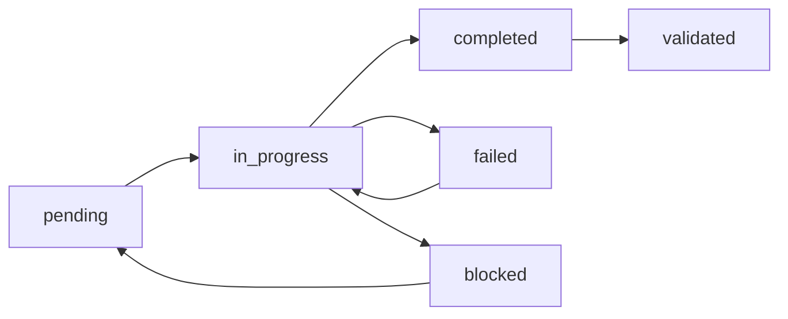

# Integration Guidelines v2 - Orchestrator Prompt Usage

## Document Purpose

This document **extends** [`INTEGRATION_GUIDELINES.md`](INTEGRATION_GUIDELINES.md) with specific guidance on using the customized orchestrator prompt ([`orchestrator_agent_prompt.md`](orchestrator_agent_prompt.md)) and templates ([`prompt_templates.json`](prompt_templates.json)) for Phase 3 implementation.

**Read this AFTER** reviewing the base integration guidelines.

---

## 1. Quick Start Guide

### 1.1 For Phase 3 Implementation Team

**Start Here:**
1. Read [`orchestrator_agent_prompt.md`](orchestrator_agent_prompt.md) Section 1 (Project Context)
2. Identify your sprint (Sprint 1, 2, or 3)
3. Use the appropriate task template from [`prompt_templates.json`](prompt_templates.json)
4. Follow the workflow examples in Section 6 of the orchestrator prompt

**Don't Start Here:**
- ❌ Don't read the base orchestrator spec first (too generic)
- ❌ Don't try to memorize all templates (use as reference)
- ❌ Don't skip the project context (you'll miss critical constraints)

### 1.2 Three-Minute Orientation

**What You Need to Know:**

1. **The Orchestrator Coordinates, Doesn't Implement**
   - It delegates tasks to specialist modes
   - It validates their returns (boomerang pattern)
   - It maintains project state
   - It requests human approval at gates

2. **You Have Pre-Built Templates**
   - Monthly research update (recurring task)
   - Pattern integration (adding workflow patterns)
   - Technique enhancement (improving existing content)
   - Schema extension (rare, high-impact changes)

3. **The Project Has Three Sprints**
   - **Sprint 1** (P0): 7 patterns + 6 November techniques = foundation
   - **Sprint 2** (P1): 10 optimization techniques + enhancements
   - **Sprint 3** (P2): 15 historical techniques + relationships

4. **Human Checkpoints Matter**
   - Sprint 1 gate: Must approve before Sprint 2
   - Final deployment: Must approve production push
   - Critical decisions: Schema changes, architecture updates

---

## 2. Using Task Templates

### 2.1 When to Use Which Template

| Your Situation | Use This Template | Location |
|----------------|------------------|----------|
| New month of research to integrate | `monthly_research_update` | [`prompt_templates.json`](prompt_templates.json) → templates.research_integration |
| Adding a workflow pattern | `pattern_integration` | [`prompt_templates.json`](prompt_templates.json) → templates.research_integration |
| Improving existing technique | `technique_enhancement` | [`prompt_templates.json`](prompt_templates.json) → templates.research_integration |
| Modifying data schema | `schema_extension` | [`prompt_templates.json`](prompt_templates.json) → templates.research_integration |
| Full content synthesis cycle | `content_synthesis` | [`prompt_templates.json`](prompt_templates.json) → templates.site_update |
| Need to deploy to production | `deployment` | [`prompt_templates.json`](prompt_templates.json) → templates.site_update |
| Production issue requires rollback | `emergency_rollback` | [`prompt_templates.json`](prompt_templates.json) → workflows |

### 2.2 How to Use a Template

**Step-by-Step Process:**

1. **Identify Your Task**
   ```
   Example: "I need to integrate the November 2025 research"
   Template: monthly_research_update
   ```

2. **Load the Template**
   ```javascript
   // From prompt_templates.json
   const template = templates.research_integration.monthly_update;
   ```

3. **Customize for Your Task**
   ```json
   {
     "task_id": "research_update_2025_11",  // Follow pattern
     "research_period": "November 2025",     // Your specific month
     "priority_filter": "P0 and P1 only"     // Based on sprint
   }
   ```

4. **Execute the Subtasks**
   - Follow the subtask sequence in the template
   - Each subtask has: mode, inputs, outputs, acceptance criteria
   - Wait for boomerang return after each subtask
   - Validate before proceeding

5. **Handle Human Checkpoints**
   - Template specifies when checkpoints required
   - Present artifacts as defined in template
   - Wait for user approval
   - Document approval in state

**Example: Monthly Update**

```yaml
# From orchestrator_agent_prompt.md Section 2.1
task_execution:
  subtask_1:
    mode: "Research Specialist"
    action: "Collect November research"
    wait_for: "Boomerang return with synthesis document"
    validate: "Document exists, 5+ items identified, citations correct"
    
  subtask_2:
    mode: "Content Strategist"  
    action: "Classify and prioritize items"
    wait_for: "Boomerang return with priority matrix"
    validate: "All items classified, priorities assigned"
    
  # ... continue through subtasks 3-5
  
  checkpoint:
    when: "If > 10 items identified"
    present: "Priority breakdown, timeline, risks"
    required: "User approval to proceed"
```

### 2.3 Template Customization Rules

**You CAN Customize:**
- Specific file paths (adjust to your research location)
- Priority filters (P0-only vs P0+P1 vs all)
- Effort estimates (based on your team's velocity)
- Mode selection (use alternates from delegation matrix)
- Validation criteria specificity (stricter or looser)

**You CANNOT Customize:**
- Boomerang pattern (must always return to orchestrator)
- Human checkpoint requirements (defined by task type)
- Schema validation rules (these are absolute)
- File restrictions per mode (architect = .md only, etc.)
- Hierarchical task structure (Strategic → Tactical → Operational)

**Ask First Before Customizing:**
- Phase structure or dependencies
- Task decomposition approach
- State management approach
- Error recovery procedures

---

## 3. Workflow Execution Patterns

### 3.1 Linear Workflow (Simple)

**When:** Tasks have strict sequential dependencies

**Pattern:**
```
orchestrator → delegate task_1 → wait for return → validate → 
              → delegate task_2 → wait for return → validate →
              → delegate task_3 → wait for return → validate →
              → complete
```

**Example:** Schema extension (must do design before implementation)

### 3.2 Parallel Workflow (Efficient)

**When:** Multiple tasks have no mutual dependencies

**Pattern:**
```
orchestrator → delegate [task_1, task_2, task_3] in parallel →
              → wait for all returns →
              → validate all →
              → proceed to next stage
```

**Example:** Sprint 1 patterns (pattern_001 through pattern_004 independent)

**See:** [`orchestrator_agent_prompt.md`](orchestrator_agent_prompt.md) Section 6.3 for detailed example

### 3.3 Wave-Based Workflow (Optimized)

**When:** Some tasks block others, but parallelization possible within waves

**Pattern:**
```
Wave 1: [foundation task] → validate → 
Wave 2: [parallel group A, parallel group B, parallel group C] → validate all →
Wave 3: [sequential dependent tasks] → validate →
Complete
```

**Example:** Sprint 1 execution
- **Wave 1**: infrastructure_001 (blocks everything)
- **Wave 2**: All patterns and techniques in parallel (3 groups)
- **Wave 3**: Dependent patterns (pattern_005, pattern_006)

**See:** [`prompt_templates.json`](prompt_templates.json) → workflows.sprint_execution

### 3.4 Error-Recovery Workflow (Resilient)

**When:** Task validation fails or specialist returns error

**Pattern:**
```
orchestrator → delegate task → 
              → return: status = failed →
              → analyze error type →
              → select recovery procedure →
              → delegate fix task →
              → re-validate →
              → retry original task OR escalate
```

**Example:** Deployment failure with schema errors

**See:** [`orchestrator_agent_prompt.md`](orchestrator_agent_prompt.md) Section 5 (Error Recovery)

---

## 4. Human Checkpoint Best Practices

### 4.1 When Checkpoints Occur

**Automatic Checkpoints** (orchestrator initiates):
- Sprint 1 completion (after 13 P0 items integrated)
- Schema extension approval (before implementation)
- Production deployment (before pushing to main)

**Conditional Checkpoints** (based on conditions):
- Monthly update with > 10 items (too large to auto-approve)
- Critical validation failures (need user decision)
- Error recovery timeout (30 min without resolution)

**User-Requested Checkpoints** (user asks):
- "Show me current progress"
- "I'd like to review before proceeding"
- Any time user asks for status

### 4.2 How to Present Checkpoints

**Use the Standard Format** from [`orchestrator_agent_prompt.md`](orchestrator_agent_prompt.md) Section 1.3:

```markdown
# 🎯 Human Checkpoint: [Checkpoint Name]

## Context
[Why we're at this checkpoint]

## Completed Work
- [x] Task 1: Description - ✅ Validated
- [x] Task 2: Description - ✅ Validated

## Artifacts Produced
1. **[file.ext]** - Description and path
2. **[file.ext]** - Description and path

## Key Decisions Made
- Decision with rationale
- Another decision with rationale

## Next Steps (Pending Approval)
1. Next task description
2. Another task description

## Issues or Concerns
- Any blockers or risks

## Required Action
**Please review and provide:**
- ✅ Approval to proceed
- 🔄 Feedback for revisions  
- ❌ Direction to pause
```

### 4.3 Checkpoint Response Handling

**User Says "Approved":**
```yaml
orchestrator_action:
  1. Document approval in state
  2. Update boomerang-state.json
  3. Log approval to .roo/logs/orchestrator/
  4. Proceed with next phase
  5. No further questions needed
```

**User Provides Feedback:**
```yaml
orchestrator_action:
  1. Parse feedback for actionable items
  2. Create new tasks to address feedback
  3. Update affected task specifications
  4. Re-validate after addressing feedback
  5. Return to checkpoint with updates
```

**User Says "Pause" or "Stop":**
```yaml
orchestrator_action:
  1. Halt all active tasks immediately
  2. Document current state
  3. Save checkpoint state to .roo/backups/
  4. Present summary of stopping point
  5. Wait for user to resume or cancel
```

---

## 5. State Management

### 5.1 The Sacred File: boomerang-state.json

**Location:** `.roo/boomerang-state.json`

**Purpose:** Authoritative source of project state - orchestrator's memory

**Structure:**
```json
{
  "project_id": "prompt_engineering_site_integration",
  "created": "2025-11-04T00:00:00Z",
  "current_phase": "Phase_3_Sprint_1",
  "last_updated": "2025-11-04T12:34:56Z",
  "tasks": {
    "task_id": {
      "status": "pending|in_progress|completed|failed|blocked",
      "assigned_mode": "specialist_name",
      "started": "timestamp",
      "completed": "timestamp",
      "outputs": ["file", "paths"],
      "validation": "passed|failed|pending",
      "dependencies_met": true,
      "result_summary": "Key outcomes"
    }
  },
  "metrics": {
    "total_tasks": 43,
    "completed": 13,
    "in_progress": 2,
    "pending": 28,
    "completion_percentage": 30.2
  }
}
```

**Critical Rules:**
1. **Always update after task state change**
2. **Validate schema before writing**
3. **Backup before major updates** (automated)
4. **Never manually edit** (corruption risk)
5. **If corrupted, use recovery procedure** (Section 5.4 of orchestrator prompt)

### 5.2 State Transitions



**Valid Transitions:**
- `pending` → `in_progress` (task delegated)
- `in_progress` → `completed` (boomerang return, status = success)
- `in_progress` → `failed` (boomerang return, status = failed)
- `in_progress` → `blocked` (dependency issue)
- `failed` → `in_progress` (retry after fix)
- `blocked` → `pending` (dependency resolved)
- `completed` → `validated` (orchestrator validates outputs)

**Invalid Transitions (will cause state corruption):**
- ❌ `pending` → `completed` (skipping execution)
- ❌ `completed` → `failed` (can't un-complete)
- ❌ `validated` → anything (terminal state)

### 5.3 Logging Requirements

**Log Location:** `.roo/logs/orchestrator/YYYY-MM-DD.md`

**Log Every:**
- Task delegation (what, to whom, when)
- Boomerang return (status, artifacts, summary)
- Validation result (pass/fail, criteria checked)
- State update (what changed)
- Human checkpoint (presented, response)
- Error encountered (type, recovery action)

**Log Format:**
```markdown
## [HH:MM:SS] Event Type: event_id

- **Details**: Relevant information
- **Mode**: Specialist involved
- **Status**: Current status
- **Actions**: What was done
```

---

## 6. Testing Scenarios

### 6.1 Before Using Orchestrator in Production

**Run These Tests:**

**Test 1: Simple Task Delegation**
```yaml
input: "Add the MCP Server Integration technique"
validate:
  - Task map generated with 1 task
  - Correct mode selected (Data Integration Specialist)
  - Boomerang pattern followed
  - State updated correctly
  - Output validated
```

**Test 2: Multi-Step Workflow**
```yaml
input: "Integrate November research"
validate:
  - Multi-phase task map generated
  - Dependencies correctly identified
  - Parallel tasks grouped properly
  - Human checkpoint at correct point
  - All specialists engaged appropriately
```

**Test 3: Error Recovery**
```yaml
input: "Simulate schema validation failure"
validate:
  - Error detected immediately
  - Correct recovery procedure selected
  - Issue diagnosed accurately
  - Fix applied successfully
  - Retry succeeded
  - Incident logged
```

### 6.2 Validation Checklist

Before each sprint:
- [ ] Orchestrator prompt loaded with project context
- [ ] Templates accessible (prompt_templates.json)
- [ ] State file initialized (.roo/boomerang-state.json)
- [ ] Logging directory exists (.roo/logs/orchestrator/)
- [ ] Test scenarios passed
- [ ] Backup system active
- [ ] Human checkpoint process confirmed

During sprint:
- [ ] State updated after each task
- [ ] Validations passed before proceeding
- [ ] Boomerang returns properly handled
- [ ] Parallel tasks coordinated correctly
- [ ] Error recovery working as expected

After sprint:
- [ ] All tasks marked completed
- [ ] Sprint metrics calculated
- [ ] Human checkpoint presented
- [ ] Final validation passed
- [ ] State checkpoint saved

---

## 7. Common Patterns & Anti-Patterns

### 7.1 DO: Correct Patterns ✅

**Pattern: Template-Based Delegation**
```yaml
good_example:
  - Find appropriate template
  - Customize with specific context
  - Follow template's subtask sequence
  - Validate at each checkpoint
  - Document any deviations
```

**Pattern: Proper Boomerang Handling**
```yaml
good_example:
  orchestrator:
    - Delegate task with clear context
    - Wait for specialist return
    - Validate outputs against acceptance criteria
    - Update state AFTER validation
    - Proceed to next task
```

**Pattern: Effective Parallelization**
```yaml
good_example:
  orchestrator:
    - Analyze dependency graph
    - Group independent tasks
    - Delegate groups to available specialists
    - Track all returns
    - Proceed when ALL validated
```

### 7.2 DON'T: Anti-Patterns ❌

**Anti-Pattern: Skipping Validation**
```yaml
bad_example:
  orchestrator:
    - Delegate task
    - Immediately delegate next task  # ❌ Didn't wait for return
    - Assume first task succeeded     # ❌ Dangerous assumption
```
**Why Bad:** Could propagate errors through entire workflow

**Anti-Pattern: Manual State Editing**
```yaml
bad_example:
  developer:
    - Open .roo/boomerang-state.json in editor
    - Manually change task status       # ❌ Bypassing validation
    - Save file                          # ❌ Risk of corruption
```
**Why Bad:** State corruption, loses traceability, breaks recovery

**Anti-Pattern: Ignoring Human Checkpoints**
```yaml
bad_example:
  orchestrator:
    - Complete sprint tasks
    - Skip checkpoint presentation      # ❌ Required approval
    - Proceed to next sprint            # ❌ Violates protocol
```
**Why Bad:** User loses oversight, potential for unwanted changes

**Anti-Pattern: Template Misapplication**
```yaml
bad_example:
  developer:
    - Need to add one technique
    - Use "monthly_research_update" template  # ❌ Overkill
    - Execute all 5 subtasks                  # ❌ Wasted effort
```
**Why Bad:** Use simpler template (technique_enhancement) instead

---

## 8. Troubleshooting Guide

### 8.1 Common Issues

**Issue: "Orchestrator isn't delegating tasks"**

**Diagnosis:**
- Check if project context loaded correctly
- Verify mode selection matrix available
- Check if dependencies are met

**Fix:**
```bash
# Verify orchestrator initialization
cat .roo/boomerang-state.json | jq '.current_phase'

# Check task dependencies
cat .roo/boomerang-state.json | jq '.tasks.TASK_ID.dependencies_met'
```

**Issue: "Boomerang return not being validated"**

**Diagnosis:**
- Check if acceptance criteria defined
- Verify artifacts actually exist
- Check validation rules in template

**Fix:**
```yaml
Ensure template includes:
  acceptance_criteria:
    - "Specific, testable criterion"
    - "Another measurable criterion"
```

**Issue: "State file corrupted"**

**Diagnosis:**
- JSON syntax error
- Invalid state transitions
- Missing required fields

**Fix:**
- Run recovery procedure from orchestrator_agent_prompt.md Section 5.4
- Options: restore from backup, reconstruct from logs, manual rebuild
- Prevent: Always validate before writing

### 8.2 When to Escalate

**Escalate to User if:**
- Human checkpoint required but not scheduled
- Critical validation failures persist after 3 retries
- State corruption cannot be automatically recovered
- Deployment rollback triggered
- Timeline at risk (> 20% delay)

**Escalate to Architect if:**
- Schema change needed (not planned)
- Architecture constraint needs relaxation
- New mode capability required
- Template doesn't fit use case

**Escalate to Debug Specialist if:**
- Repeated failures with unclear cause
- Performance degradation detected
- Data corruption suspected
- Tool/script malfunction

---

## 9. Phase 3 Sprint Guide

### 9.1 Sprint 1 Execution (P0 Critical)

**Duration:** 2 weeks  
**Items:** 13 (7 patterns + 6 techniques)  
**Template:** Use `pattern_integration` repeatedly

**Day 1-2:**
```yaml
tasks:
  - Create Workflow Engineering category (infrastructure_001)
  - Wait for completion and validation
  - Human checkpoint: Review category structure

template_to_use: "New category creation (ad-hoc)"
delegation_to: "Web Development Specialist"
```

**Day 3-7:**
```yaml
tasks:
  - Integrate patterns 001-004 (parallel)
  - Integrate patterns 005-007 (sequential, depend on 003)
  - Integrate techniques 134-139 (parallel)

template_to_use: "pattern_integration" (x7)
coordination: "Wave-based execution (see Section 3.3)"
```

**Day 8-10:**
```yaml
tasks:
  - Comprehensive validation
  - Site rebuild and testing
  - Human checkpoint: Sprint 1 approval

template_to_use: "schema_validation" + "deployment"
```

### 9.2 Sprint 2 Execution (P1 High)

**Duration:** 1-2 weeks  
**Items:** 10 (6 techniques + 4 enhancements)  
**Template:** Mix of `direct_addition` and `technique_enhancement`

**Parallelization:** High (most tasks independent)

### 9.3 Sprint 3 Execution (P2 Medium)

**Duration:** 1-2 weeks  
**Items:** 15 (historical techniques)  
**Template:** Primarily `direct_addition`

**Focus:** Relationship mapping and documentation

---

## 10. Success Metrics

### 10.1 Orchestrator Performance Metrics

**Efficiency Metrics:**
- Average time from delegation to validated return
- Parallel execution efficiency (vs sequential baseline)
- Human checkpoint response time
- Error recovery time

**Quality Metrics:**
- First-time validation pass rate
- Number of retries per task
- Schema validation failures
- Regression test pass rate

**Project Metrics:**
- Sprint completion on schedule
- Total items integrated
- Zero critical issues deployed
- User satisfaction score

### 10.2 Success Criteria

**Sprint 1 Success:**
- [ ] 13 P0 items integrated and validated
- [ ] Workflow Engineering category live
- [ ] Zero breaking changes
- [ ] Performance maintained
- [ ] Human checkpoint approved

**Overall Project Success:**
- [ ] All 43 items integrated
- [ ] Automated pipelines operational
- [ ] Site quality score maintained
- [ ] User acceptance achieved
- [ ] Documentation complete

---

## 11. Quick Reference

### 11.1 File Locations

| File | Purpose | Location |
|------|---------|----------|
| **Orchestrator Prompt** | Main prompt specification | [`design/orchestrator_agent_prompt.md`](orchestrator_agent_prompt.md) |
| **Task Templates** | JSON templates | [`design/prompt_templates.json`](prompt_templates.json) |
| **Content Strategy** | What to integrate | [`design/content_synthesis_framework.md`](content_synthesis_framework.md) |
| **Priority Matrix** | All 43 items detailed | [`design/content_prioritization_matrix.json`](content_prioritization_matrix.json) |
| **State File** | Current project state | `.roo/boomerang-state.json` |
| **Logs** | Orchestrator activity | `.roo/logs/orchestrator/YYYY-MM-DD.md` |

### 11.2 Command Quick Reference

```bash
# Validate state file
cat .roo/boomerang-state.json | jq '.'

# Check current phase
cat .roo/boomerang-state.json | jq '.current_phase'

# List pending tasks
cat .roo/boomerang-state.json | jq '.tasks | to_entries | map(select(.value.status == "pending"))'

# View recent logs
tail -f .roo/logs/orchestrator/$(date +%Y-%m-%d).md

# Backup state
cp .roo/boomerang-state.json .roo/backups/state-$(date +%s).json

# Validate content
npm run validate:content

# Run tests
npm test
```

### 11.3 Key Contacts

**Phase 2 Team:**
- Content Strategy: documented in [`content_synthesis_framework.md`](content_synthesis_framework.md)
- Technical Architecture: documented in [`SYSTEM_ARCHITECTURE.md`](SYSTEM_ARCHITECTURE.md)
- Orchestrator Design: this document

**Phase 3 Implementation:**
- Orchestrator Usage Questions: Reference this guide first
- Technical Issues: Use Debug Specialist mode
- Strategic Decisions: Request human checkpoint

---

## Appendix A: Template Selection Decision Tree

```
Start: What are you trying to do?

├─ "Integrate new research"
│  ├─ One or two new items → Use: technique_enhancement
│  └─ Multiple items (> 3) → Use: monthly_research_update
│
├─ "Add a workflow pattern"  
│  └─ Use: pattern_integration
│
├─ "Improve existing item"
│  └─ Use: technique_enhancement
│
├─ "Change data structure"
│  └─ Use: schema_extension (requires human approval)
│
├─ "Deploy to production"
│  ├─ Normal deployment → Use: deployment workflow
│  └─ Emergency rollback → Use: emergency_rollback
│
└─ "I don't know / Something else"
   └─ Consult: orchestrator_agent_prompt.md Section 2
```

---

## Appendix B: Glossary

**Boomerang Pattern:** Task delegation pattern where all tasks return to orchestrator for validation

**Human Checkpoint:** Required approval point where user reviews and approves progress

**Mode:** Specialist agent with specific capabilities (e.g., Research Specialist, Code Mode)

**Pathway A/B/C:** Integration strategies (Direct Addition, Enhanced Merge, New Structure)

**P0/P1/P2/P3:** Priority levels (Critical, High, Medium, Low)

**Sprint:** Time-boxed development period (1-2 weeks)

**State File:** `boomerang-state.json` - authoritative project state

**Template:** Reusable task structure for common operations

**Wave:** Group of tasks in wave-based execution (foundation → parallel → sequential)

---

**Document Status:** DRAFT - Ready for Phase 3 Handoff  
**Version:** 2.0  
**Author:** Architect Mode  
**Date:** 2025-11-04  
**Related Documents:**
- [`orchestrator_agent_prompt.md`](orchestrator_agent_prompt.md) - Complete orchestrator specification
- [`prompt_templates.json`](prompt_templates.json) - Machine-readable templates
- [`INTEGRATION_GUIDELINES.md`](INTEGRATION_GUIDELINES.md) - Base integration guidelines
- [`content_synthesis_framework.md`](content_synthesis_framework.md) - Content strategy

**Next Steps:**
1. Review by Phase 3 team
2. Test scenarios execution
3. Refinement based on usage
4. Production deployment guidance

---

*This guide enables Phase 3 teams to use the orchestrator effectively while maintaining quality and oversight.*